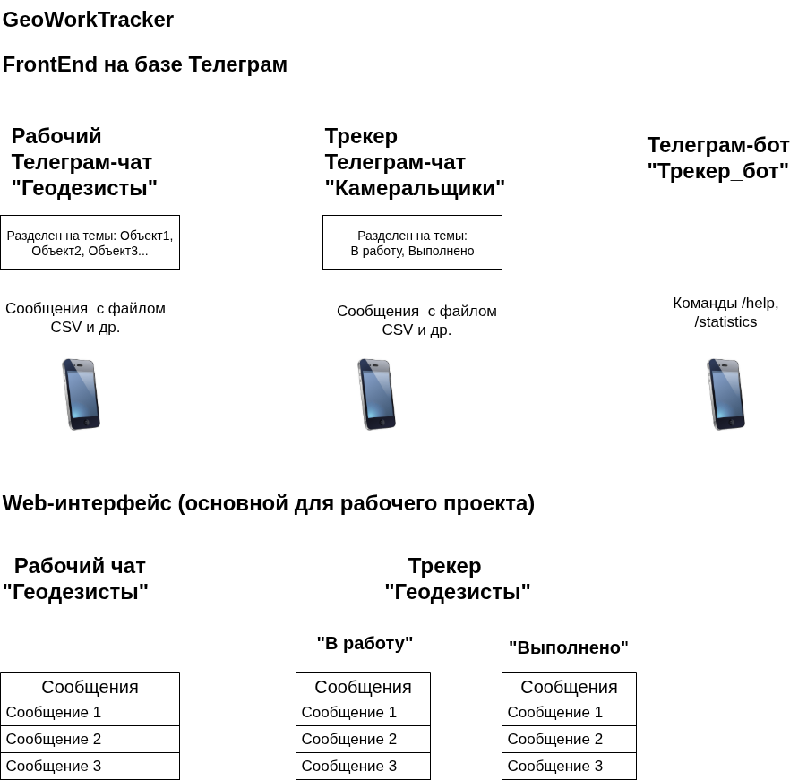

# ok-geoworktracker

Ильин Николай - проектная работа. 
Проект курса
[Kotlin Backend Developer](https://otus.ru/lessons/kotlin/).
Поток курса 2025-05.

Geoworktracker - это сервис для трекинга геодезических файлов(csv, dwg, pdf) между полевыми геодезистами и камеральными сотрудниками. 
Задача сервиса - обеспечить прозрачный workflow, сохранность файлов, контроль за своевременной обработкой файлов.
## Визуальная схема фронтенда

## Документация

1. Маркетинг и аналитика
    1. [Целевая аудитория](./docs/01-biz/01-target-audience.md)
    2. [Заинтересанты](./docs/01-biz/02-stakeholders.md)
    3. [Бизнес-требования](./docs/01-biz/03-bizreq.md)
2. Аналитика:
    1. [Функциональные требования](./docs/02-analysis/01-functional-requiremens.md)
    2. [Нефункциональные требования](./docs/02-analysis/02-nonfunctional-requirements.md)
3. Архитектура
    1. [ADR](docs/03-architecture/01-adrs.md)
    2. [Описание API](docs/03-architecture/02-api.md)
    3. [Архитектурные схемы](docs/03-architecture/03-arch.md)
4. DevOps
    1. [Файлы сборки](./deploy)

# Структура проекта

## Подпроекты - уроки по языку Kotlin

1. [m1-init](lessons/m1-init) - Домашнее задание 1
 
### Плагины Gradle сборки проекта

1. [build-plugin](build-plugin) Модуль с плагинами
2. [BuildPluginJvm](build-plugin/src/main/kotlin/BuildPluginJvm.kt) Плагин для сборки проектов JVM
3. [BuildPluginMultiplarform](build-plugin/src/main/kotlin/BuildPluginMultiplatform.kt) Плагин для сборки
   мультиплатформенных проектов

## Проектные модули

### Транспортные модели, API

